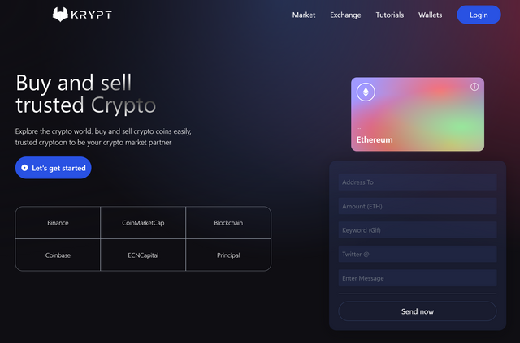

# Krypt - Web 3.0 Blockchain Application

Date: 2022

A Web 3.0 application that allows users to send transactions throw the Blockchain.

## Introduction
This project uses; 
* Web 3.0 methodologies
* Solidity
* Metamask 

